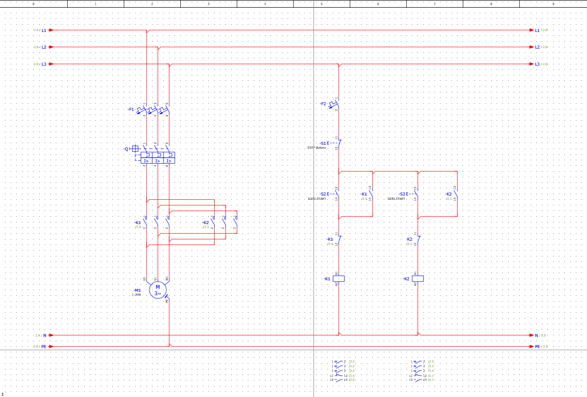

# İleri-Geri Motor Kontrol Projesi

Bu proje, üç fazlı asenkron motorun ileri ve geri yönde çalıştırılmasına yönelik olarak EPLAN Electric P8 ortamında hazırlanmıştır. Projede motorun dönüş yönünün kontaktörler aracılığıyla değiştirilmesi için güç ve kumanda devreleri tasarlanmıştır.

## Projenin Amacı

Üç fazlı asenkron motorun ileri ve geri yönde kontrollü olarak çalıştırılması ve kontaktörler arasında uygulanan elektriksel kilitleme ile ileri ve geri kontaktörlerinin aynı anda devreye girmesinin önlenmesi amaçlanmıştır.

## Kullanılan Ekipmanlar

- Üç fazlı asenkron motor
- İleri yön kontaktörü
- Geri yön kontaktörü
- Motor koruma şalteri
- Sigortalar
- İleri start butonu
- Geri start butonu
- Stop butonu

## Çalışma Prensibi

İleri start butonuna basıldığında ileri yön kontaktörü enerjilenir ve yardımcı NO kontağı üzerinden mühürleme sağlanır. Motor ileri yönde çalışmaya devam eder.

Geri start butonuna basıldığında geri yön kontaktörü enerjilenir ve yardımcı NO kontağı üzerinden mühürleme sağlanır. Güç devresinde iki fazın bağlantı sırası değiştirilerek motorun dönüş yönü tersine çevrilir.

İleri ve geri kontaktörlerinin aynı anda devreye girmesini önlemek amacıyla kontaktörlerin NC yardımcı kontakları kullanılarak elektriksel kilitleme uygulanmıştır.

Stop butonuna basıldığında kumanda devresinin enerjisi kesilir, aktif kontaktör bırakır ve motor durur.

## Devre Şeması

Aşağıdaki şemada ileri-geri motor kontrolüne ait güç ve kumanda devreleri gösterilmektedir.

## Kullanılan Yazılım

- EPLAN Electric P8

## Proje Dosyası

Repository içerisinde EPLAN Electric P8 ile hazırlanmış proje dosyası (`forward-reverse-motor-control.elk`) bulunmaktadır.
